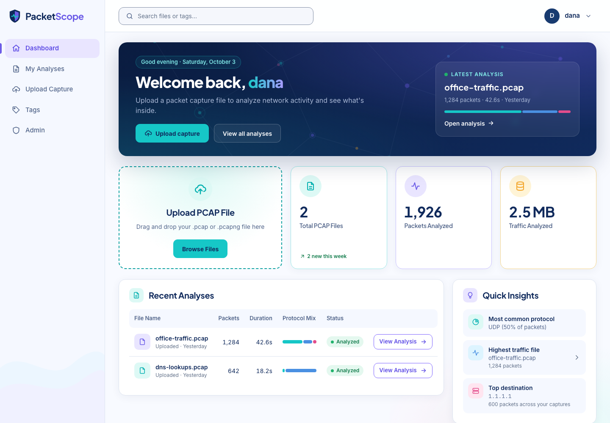
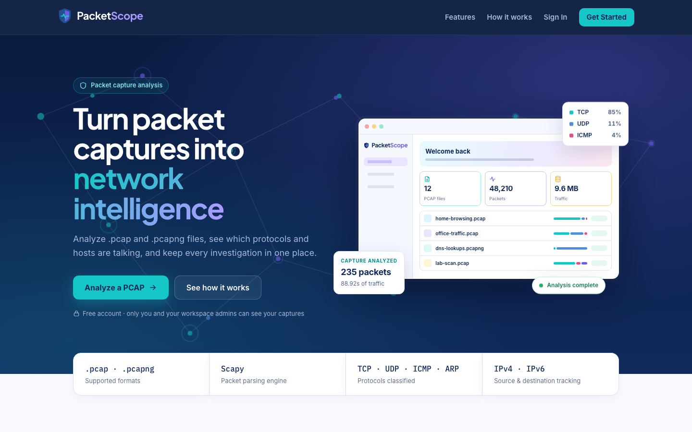
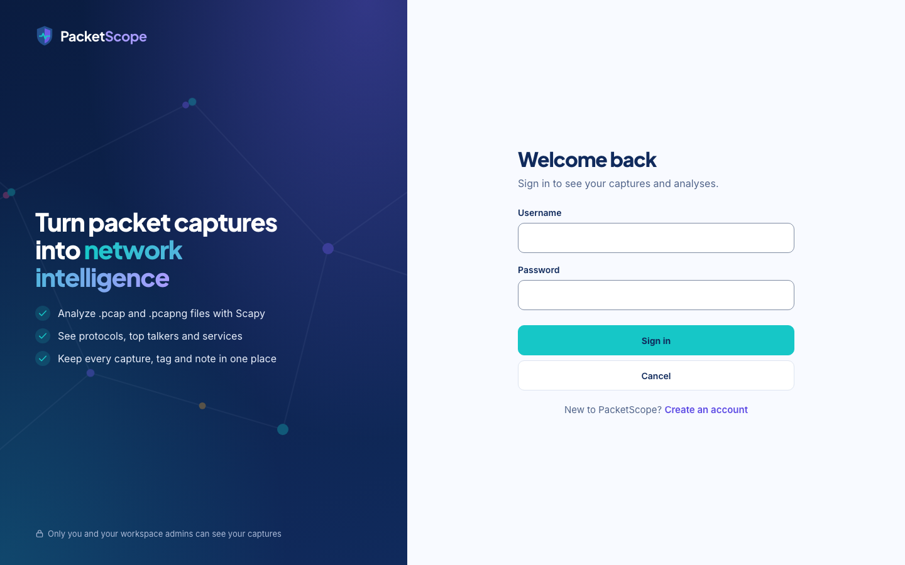
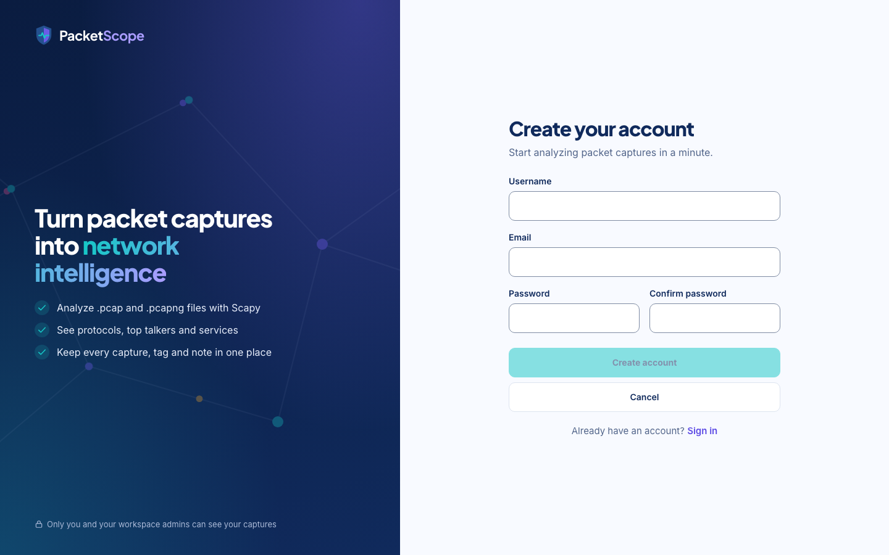
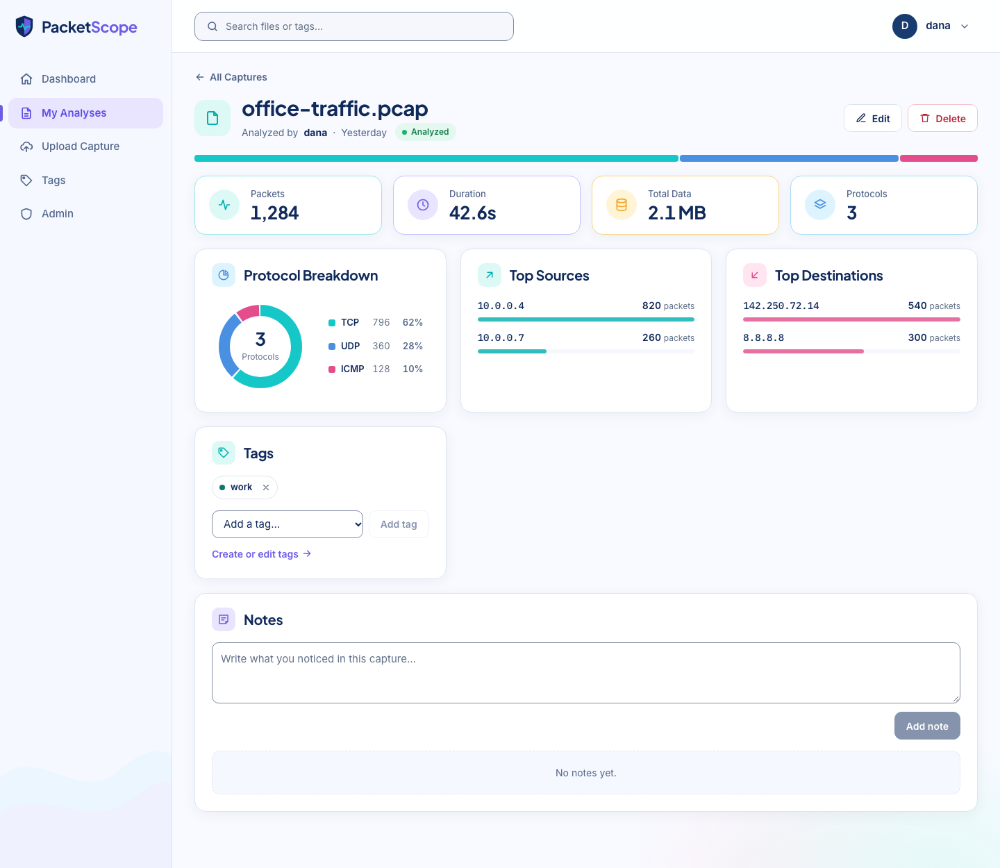
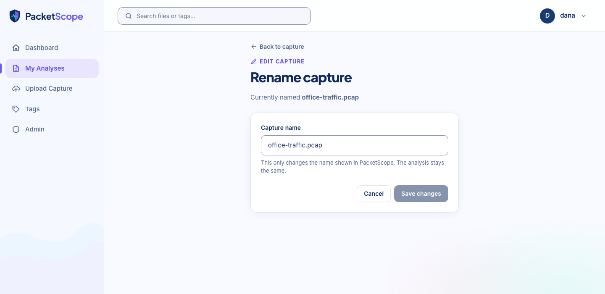
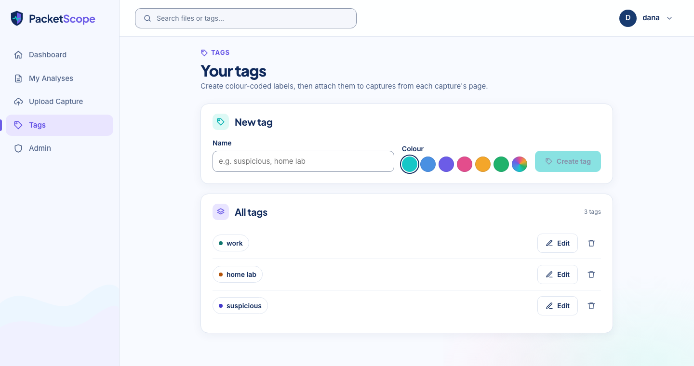
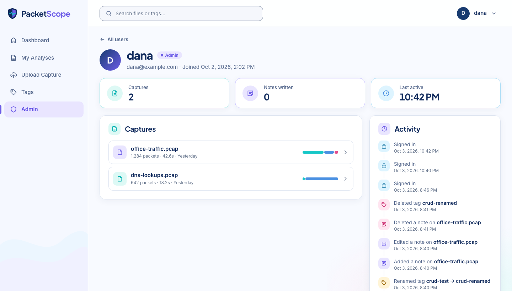
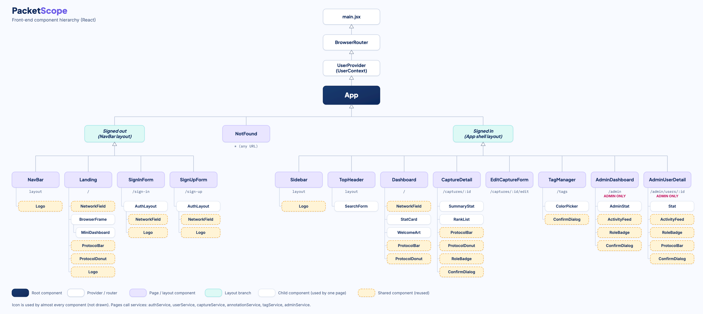

# PacketScope — Front End

**Turn packet captures into network intelligence.**



PacketScope is a full-stack cybersecurity web app (**React + FastAPI + PostgreSQL**) for analyzing network packet captures. Upload a `.pcap` or `.pcapng` file and the back end parses it with [Scapy](https://scapy.net/); the front end turns the result into a clear picture of the traffic — protocols, top talkers, services and packet sizes — and keeps every analysis organized with tags and notes.

🌐 **Live app:** [https://packetscope-psi.vercel.app](https://packetscope-psi.vercel.app)

⚙️ **Back-end repo:** [packetscope-back-end](https://github.com/dana12812/packetscope-back-end)

---

## Table of contents

1. [Why I built it](#why-i-built-it)
2. [Features](#features)
3. [User roles](#user-roles)
4. [Screenshots](#screenshots)
5. [Getting started](#getting-started)
6. [Planning materials](#planning-materials)
7. [Database design](#database-design)
8. [Technologies used](#technologies-used)
9. [Attributions](#attributions)
10. [Next steps](#next-steps)

---

## Why I built it

A `.pcap` file is a recording of network traffic — every packet in and out — but on its own it is an opaque binary file. Making sense of one usually means installing a heavy desktop tool like Wireshark, digging through thousands of packets, and losing your findings when you close it.

PacketScope focuses on two things:

- **Visibility** — an instant summary of what's inside a capture: which protocols, which hosts, which services, how much traffic.
- **Organization** — every analysis is saved to your account, and you can tag captures and write notes so nothing gets lost.

## Features

| Feature | What it does |
|---|---|
| **Accounts** | Sign up, sign in and sign out with JWT authentication. The saved session is verified with the server on load, so an expired login signs out cleanly. |
| **Upload & analyze** | Drag and drop (or browse for) a `.pcap` / `.pcapng` file up to 5 MB. The back end parses it with Scapy. |
| **Dashboard** | Welcome banner with your latest analysis, totals (captures, packets, traffic, new this week), recent analyses, quick insights (most common protocol, highest-traffic file, top destination), a protocol breakdown chart, recent activity and search by file name or tag. |
| **Capture detail** | Packets, duration, total data and protocol count; an interactive protocol donut chart; top sources, top destinations and top services; packet size statistics. |
| **Notes** | Add, edit and delete notes on a capture. Each note shows its author, role and time. |
| **Tags** | A Tags page to create, rename, recolor and delete tags, and attach or remove them on any capture. |
| **Admin** | Admins see every user, an activity log of who did what, each user's captures and activity; they can promote or remove admins, delete users, and open any capture to read it and add notes. |
| **Accessible & responsive** | WCAG AA color contrast, visible keyboard focus, labelled forms, status shown with text (not color alone), reduced-motion support, and a mobile layout with a slide-out menu. |

**Full CRUD** in the interface:

| Resource | Create | Read | Update | Delete |
|---|---|---|---|---|
| Captures | Upload | Dashboard + detail page | Rename, attach/remove tags | ✅ (with confirmation) |
| Notes | ✅ | ✅ | ✅ (author only) | ✅ (author only) |
| Tags | ✅ | ✅ | Rename + color | ✅ (with confirmation) |

## User roles

| | User | Admin |
|---|---|---|
| Upload, view, edit and delete **their own** captures | ✅ | ✅ |
| Create and manage **their own** tags and notes | ✅ | ✅ |
| See all users and the activity log | — | ✅ |
| Open another user's capture and add notes | — | ✅ (read + notes only) |
| Edit or delete another user's capture | — | — |
| Promote / remove admins, delete users | — | ✅ |

Guests (signed out) can only see the landing, sign-in and sign-up pages. Edit and delete controls are only shown to the user who created the data.

## Screenshots

| Landing | Sign in | Sign up |
|---|---|---|
|  |  |  |

| Dashboard | Capture detail | Edit capture |
|---|---|---|
|  |  |  |

| Tags | Admin |
|---|---|
|  |  |

## Getting started

- **Live app:** [https://packetscope-psi.vercel.app](https://packetscope-psi.vercel.app)
- **Back-end repo:** [packetscope-back-end](https://github.com/dana12812/packetscope-back-end)
- **Planning materials:** see [below](#planning-materials)

To run the front end locally (the [back end](https://github.com/dana12812/packetscope-back-end) must be running too):

```bash
git clone https://github.com/dana12812/packetscope-front-end.git
cd packetscope-front-end
npm install
```

Copy `.env.example` to `.env` in the project root:

```
VITE_BACK_END_SERVER_URL=http://localhost:8000/api
```

Then start the dev server:

```bash
npm run dev
```

## Planning materials

- **ERD:** [PacketScope on DrawSQL](https://drawsql.app/teams/dana-alsaleh/diagrams/packetscope)
- **Component hierarchy:**



## Database design

The back end uses **PostgreSQL**, hosted on **[Neon](https://neon.tech)**, with six tables:

| Table | Purpose |
|---|---|
| `users` | Accounts, with a `role` of `user` or `admin` |
| `captures` | An uploaded capture and its parsed summary |
| `annotations` | Notes on a capture |
| `tags` | Color-coded labels |
| `capture_tags` | Join table — captures ↔ tags are many-to-many |
| `activities` | Audit log of user actions for the admin page |

A user has many captures, notes and tags; a capture has many notes. See the full ERD, API endpoints and parsing details in the **[back-end README](https://github.com/dana12812/packetscope-back-end)**.

## Technologies used

| Category | Technologies |
|---|---|
| **Front end** | React 19, Vite, React Router, JavaScript |
| **Styling** | CSS with custom properties, Flexbox and Grid (no CSS framework) |
| **Charts & icons** | Hand-built inline SVG (no chart or icon library) |
| **Data** | Fetch API (AJAX) to the PacketScope REST API, JWT in `localStorage` |
| **Back end** | Python, FastAPI, SQLAlchemy, Pydantic, PostgreSQL, Scapy, PyJWT, bcrypt |
| **Deployment** | [Vercel](https://vercel.com) (front end), [Render](https://render.com) (API), [Neon](https://neon.tech) (PostgreSQL database) |
| **Planning** | DrawSQL |

## Attributions

- [Scapy](https://scapy.net/) — packet parsing (used by the back end)
- [Google Fonts](https://fonts.google.com/) — [Inter](https://fonts.google.com/specimen/Inter), [Plus Jakarta Sans](https://fonts.google.com/specimen/Plus+Jakarta+Sans) and [IBM Plex Mono](https://fonts.google.com/specimen/IBM+Plex+Mono), under the SIL Open Font License
- [React](https://react.dev/), [Vite](https://vite.dev/) and [React Router](https://reactrouter.com/)


## Next steps

Planned features for future versions:

- **Filter by tag** — narrow the dashboard to a single tag
- **Packet browser** — browse and search individual packets by IP or protocol
- **Geo-IP map** — plot external IP locations, looked up from the back end so no keys live in the front end
- **Anomaly flags** — automatically highlight patterns like port scans or ARP spoofing
- **PDF export** — download a capture summary to share
- **Dark mode**
- **Admin tools** — user search and pagination for larger teams

---

**Author:** Dana AlSaleh — [GitHub](https://github.com/dana12812)
